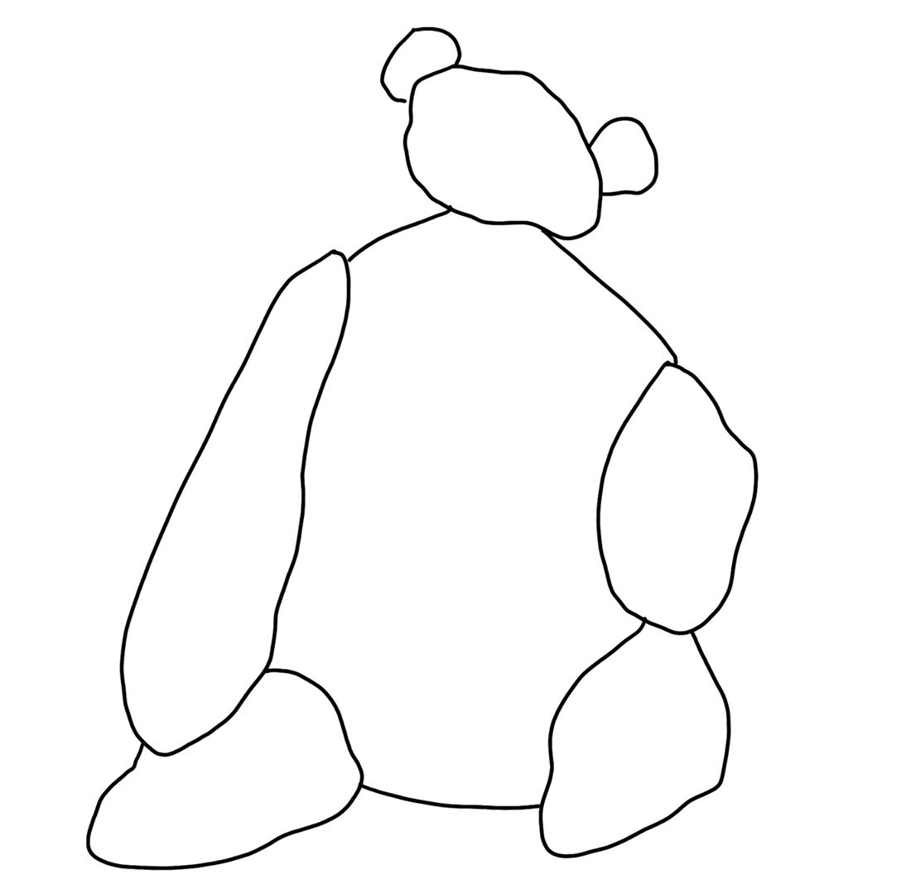

# pic2triangle
Welcome to **img2triangle**! **img2triangle** is a specialized tool designed for image triangulation. It processes an input image to identify boundaries and subsequently generate triangle mesh through boundaries. The triangulated data is saved in a structured JSON format, suitable for further rendering or analysis.

## Features
1. **Image Boundary Detection:** Identifies the primary contours and structures within the image by recognizing its edges.
2. **Triangulation:**  Segments the image into triangular regions.
3. **Visualization:** Provides a visual representation of the triangulated image.
4. **JSON Export:** Outputs the triangulated data in a structured JSON format.

## How to use it
### Environment Setup
Before using the tool, ensure the following Python libraries are installed:
* OpenCV (cv2)
* NumPy (numpy)
* Triangle (triangle)
* Matplotlib (matplotlib)

You can install all these libraries using pip:
```
pip install opencv-python numpy triangle matplotlib
```
### Execution Steps
To utilize the tool, execute the following command:
```
python img2triangle.py
```

## Systematic Breakdown
### Input Image
Start by designing your own graphic image. This could be an image you've created using a digital drawing tool on your PC, an artwork on your iPad, or even a hand-drawn sketch that you've scanned.



### Boundary Detection Phase
The tool utilizes OpenCV's robust functions to detect image boundaries, thereby outlining major image segments.
* **Edge Detection:** The image is first converted to grayscale, and then the Canny function from the OpenCV library is used to detect edges within this grayscale image.
```
gray = cv2.cvtColor(image, cv2.COLOR_BGR2GRAY)
edges = cv2.Canny(gray, 220, 240)
```
* **Contour Identification:** The detected edges are accentuated using dilation. After dilation, the contours (or boundaries) are extracted from these edges.
```
kernel = np.ones((5,5),np.uint8)
dilated = cv2.dilate(edges, kernel, iterations=1)
contours, hierarchy = cv2.findContours(dilated, cv2.RETR_TREE, cv2.CHAIN_APPROX_SIMPLE)
```
* **Polygonal Simplification:** Each contour is simplified into polygonal shapes using the approxPolyDP function. This allows intricate designs to be represented as basic polygons, which allows to futher generate triangle mesh.
```
epsilon = 0.001 * cv2.arcLength(contour, True)
approx = cv2.approxPolyDP(contour, epsilon, True)
```


### Triangulation Process
The identified boundaries are further processed to produce a triangular partitioning of the image.
* **Triangulation Operation:** The Triangle library is used to partition the identified regions into triangles.
```
vertex_array = np.vstack(points).astype(np.float32)
vertex_dict = {'vertices': vertex_array, 'segments': segments}
tri_data = triangle.triangulate(vertex_dict, 'pa800')
```


### Visualization via JSON
The derived triangular data is transcribed into a JSON file. This JSON file can then be processed by various renderers to visualize the triangulated design.
* **JSON Compilation:** All the triangular data is documented in a structured JSON format, which enhances its usability across different applications.
```
json_data = triangles_to_json(triangle_points, image)
save_to_json(json_data, 'triangles.json')
```


## Contributing
Contributions to enhance the tool's functionality are welcome. Please fork the repository, make modifications, and submit pull requests.

## License
This project is under the GNU GPLv3 License. Refer to the LICENSE file for more information.

Thank you for using img2triangle.